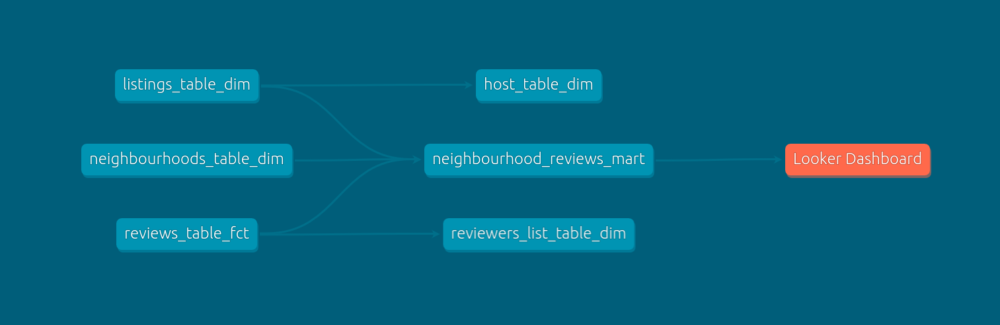
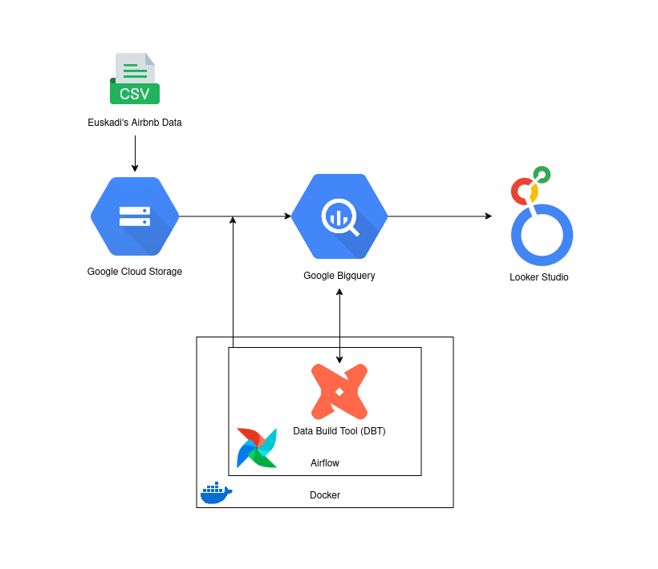

# DBT Modelling using AIRBNB Data

This repo is used for learning purposes. The project aims to use DBT for Data Modelling with Airbnb ingested from Google Cloud Storage, hosted on Google BigQuery, and are visualized with Looker Studio.

### Airflow

We use airflow to orchestrate our DAGs and task. To build airflow with docker we have to use 3 docker images from apache-airflow which is Airflow database, scheduler, and webserver.

Besides the 3 docker images airflow, I created the init-airflow image which run the script of initializing airflow. This script will initiliaze and create an account which airflow will use (username: admin, password: rahasia). We have to ensure that initializion process is done before webserver & scheduler images run (this image depends on the airflow postgres to store airflow account info).

Both webserver & scheduler use the same environment using the `.env` file. Both also uses the neccessary volumes needed to run the DAGs, such as our airbnb project & profiles directory, our keys, and our DAGs folder.

### Data Build Tool (DBT) 



As per above, as we can see, we use DBT to effieciently create models using models using sql queries to transform the data. Making it easier for us reuse queries and  transformation for further transformation.

DBT is perfect when we the data we want to transform is already loaded to the warehouse of our project, alias an ELT (Extract, Load, Transform) approach.

Afer we created the DBT project directory, we add the directory to the airflow volumes, so it can be found when it is being runned by task.

I install dbt in this project by installing it first in the init_airflow images and then add the profiles and project folder so airflow can find them. Therefore, we can just use the BashOperator and run it with shell commands below.

```
dbt run --models model_name --profiles-dir dir/to/dbt/profiles --project-dir dir/to/dbt/project
```

### Summary

Project Diagram :



This project is based loosely on the course of [dbt zero to hero](https://github.com/nordquant/complete-dbt-bootcamp-zero-to-hero). But focusing more on using Google Cloud Service buckets to store csv files, ingesting it to bigquery and repractising my data modelling skills with a different dataset.

The dashboard can be opened [here](https://lookerstudio.google.com/reporting/8a45ff57-fd4d-4d65-a9ba-4b0401deaafe). It's not finished yet, but if you want to play around and check my progress, you can check it there.

Any comments or crtiques are appreciated.
